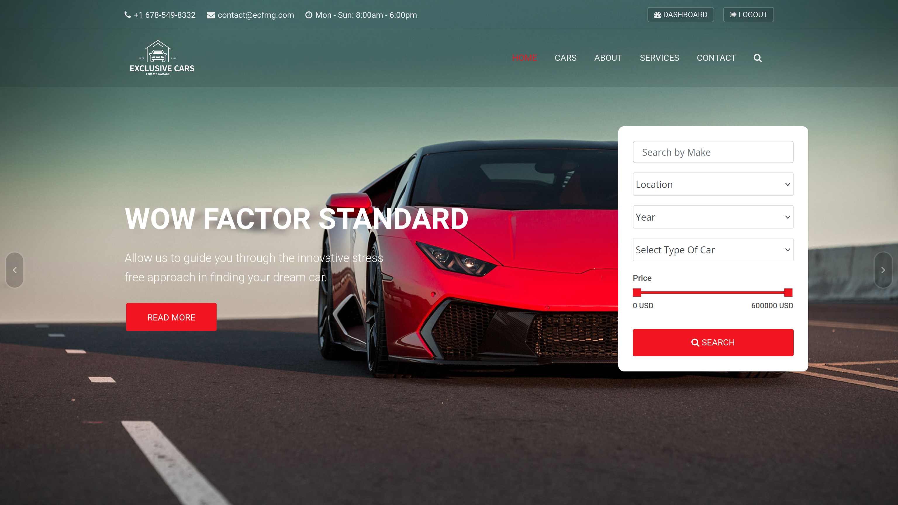
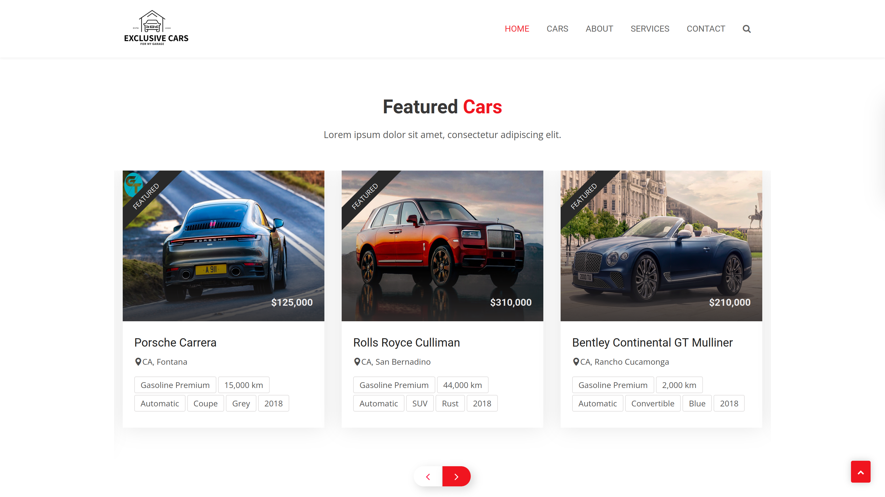
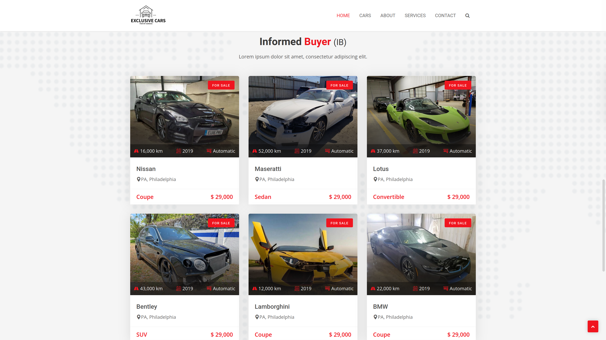
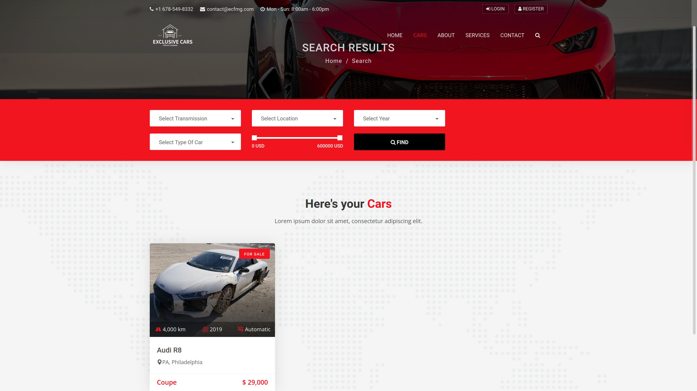
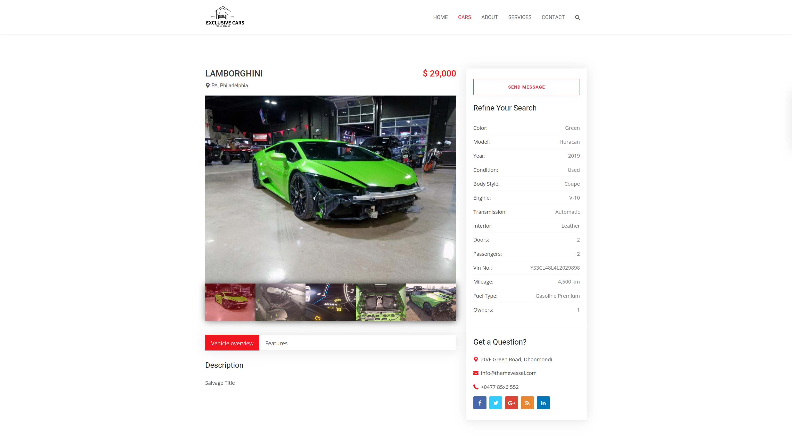
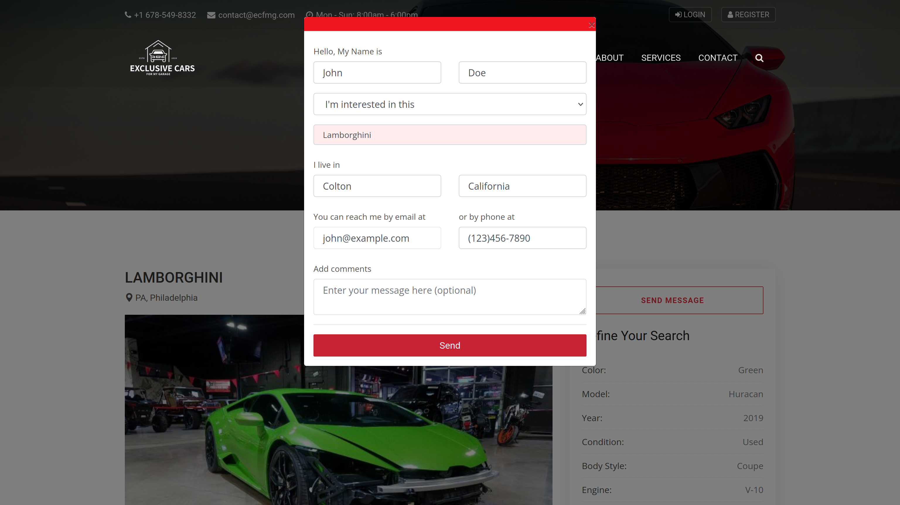
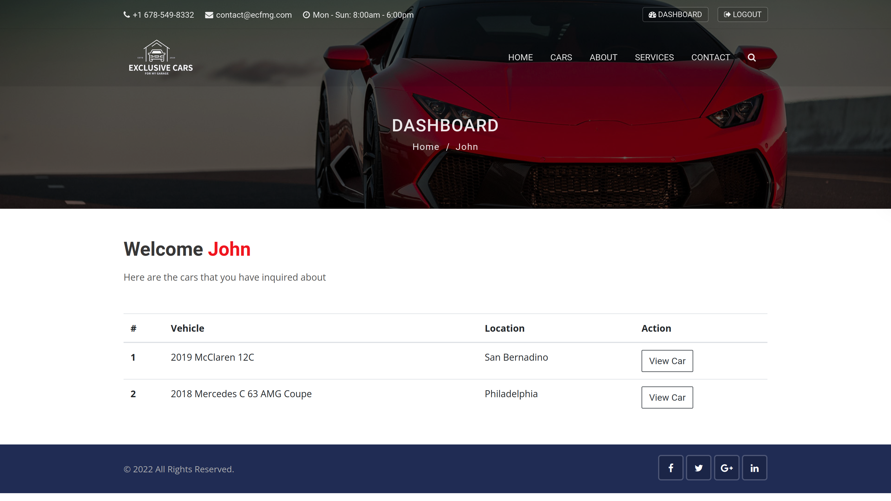

<h1> Exclusive Cars <em>For My Garage</em> (ECFMG)</h1>

<h2> Link </h2>
https://exclusivecarsformygarage.herokuapp.com/

<h2> What is ECFMG? </h2>
Exclusive Cars <em>For My Garage </em>(ECFMG) is a Cars Sales website. Clients can browse used supercars and choose from two sections, featured vehicles and informed buyer(IB). The IB category contains vehicles with a salvage title and is especially geared towards car enthusiasts. Customers can use the search feature to search for a car by make and then further filter their results. Vehicle lisings contain an impressive image gallery; prospective clients send inquiries to sellers. An inquiry is stored on the users dashboard and displayed on login (which includes OAuth 2.0 Facebook and Google).

<h2> Screenshots </h2>

<h2> Technologies Used </h2>
<ol>
<li>Python</li>
<li>Django</li>
<li>PostgreSQL</li>
<li>Git & GitHub</li>
<li>Heroku</li>
<li>Bootstrap</li>
<li>OAuth 2.0 - Facebook and Google</li>
</ol>

<h2> Technology Features</h2>
<li>Virtual Environment</li>
<li>Create Django Apps</li>
<li>Git, GitHub, Heroku</li>
<li>Implement Bootstrap Template</li>
<li>PostgreSQL Database Setup</li>
<li>Static files and Media files</li>
<li>Django Admin Customization</li>
<li>Search Functionality</li>
<li>Django Pagination</li>
<li>Django Messages</li>
<li>User Authentication</li>
<li>Login with Google and Facebook</li>
<li>Send Emails</li>
